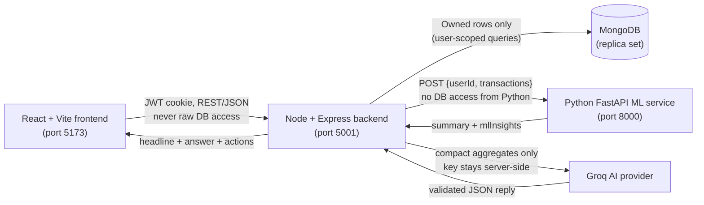

# Hishab — AI Financial Coach for Everyday Money Decisions

Hishab turns raw transaction history into clear spending insight, 4-week cash-flow forecasts, and safe, auditable goal savings — explained in **Bangla, English, and Banglish** by a bilingual AI coach.

## Hackathon

| Item | Details |
| ---- | ------- |
| Event | Upay MFS AI Hackathon |
| Track | Track 03: Customer Innovation & Financial Independence |
| Team | AUST_Hotasha |
| Members | Arafat Akib, Ehsanur Rahman, Shahriar Hamim |

## Problem Statement

Bangladesh MFS users generate plenty of transactions and wallet balances, but those numbers rarely turn into understanding. Most users cannot answer simple questions: *Where did my money go this month? Will I run short next month? Am I actually saving enough?* Existing tools are usually English-only, offer no forward-looking guidance, and give no friendly way to build savings discipline. Hishab closes that gap with understandable cash-flow insight, savings guidance, and Bangla-friendly financial support built around the wallet users already have.

## Solution Overview

Hishab takes a user's own transaction data and turns it into:

- **Spending analytics** — totals, top categories, weekly history, and dashboard views.
- **4-week forecast** — predicted income/expense per week with a weekly shortfall risk.
- **Unusual-expense detection** — IsolationForest on real data, IQR rule on small data, always labelled with the method used.
- **Smart alerts** — deduplicated future-shortfall and unusual-spending notifications.
- **Zakat calculation** — deterministic 2.5% math on nisab rules with labelled live-or-reference market data.
- **Savings goals** — manual contributions plus priority-based weekly/monthly automation.
- **Bilingual AI coaching** — Bangla / English / mixed explanations grounded only in the user's own data.
- **Safe goal actions** — chat can add savings (with wallet-balance conditions) and delete goals (with explicit confirmation) through deterministic, auditable backend services. The LLM never touches money.

## Key Features

| Area | What is implemented |
| ---- | ------------------- |
| Wallet | In-app wallet with number, BDT balance, add/withdraw money |
| Transactions | Income/expense tracking across 12 categories, history and filters |
| Dashboard & Analytics | Totals, category breakdown, spending trends, monthly summaries |
| Forecasting | 4-week LinearRegression forecast (or honest historical-average fallback) with per-week shortfall risk (`low` / `medium` / `high`) |
| Unusual spending | IsolationForest flags (10+ expenses) or IQR fallback, newest-first, capped list |
| AI coach | Bangla / English / mixed replies, at most 3 actions, disclaimer on every reply, 10 questions per 10 minutes per user |
| Manual goal saving | `POST /api/goals/:id/add-savings` moves Wallet to Goal atomically with idempotency keys |
| Goal automation | Weekly/monthly cycles, fixed 5/10/15/20/25% choices, priority order (1 funded first), pause/resume, per-cycle idempotency |
| Run now (demo) | `POST /api/goals/automation/run-now` processes only the logged-in user's currently-due cycle plus releases — same safety as the scheduler |
| Target-date release | Due goals release `savedAmount` back to the wallet exactly once, with income Transaction, ledger row, and alert |
| Funded goal deletion | Deletes the goal and refunds `savedAmount` to the wallet with a `Savings` income Transaction and a `goal_cancelled_refund` ledger row; retries never refund twice |
| AI chat contribution | Commands like “Add 500 taka to my iPhone goal” execute directly; optional wallet-balance conditions (strictly greater-than) are enforced server-side |
| AI-assisted deletion | “Delete my iPhone goal” proposes; “Yes, delete iPhone goal” executes via the same refund service; ambiguous titles ask the user to choose |
| Zakat calculator | 2.5% on cash, gold, silver, business, foreign assets and optional pension; gold nisab 87.48 g, silver nisab 612.36 g; live metals/FX when configured, otherwise clearly labelled demo reference values |
| Alerts | Shortfall, anomaly, balance, spending, budget, and savings-goal alerts with `sourceKey` deduplication |
| Privacy | Profile wallet card shows the wallet number only, never the balance; Groq sees aggregates, never raw transactions or PII |
| Auth & theme | Phone + PIN register/login, HttpOnly JWT cookie, per-user rate limits, dark/light mode |

## Demo Flow for Judges

Ready-made demo accounts (dummy data for testing only — all use PIN `123456`):

| # | Phone | PIN |
| - | ----- | --- |
| 1 | 01800000000 | 123456 |
| 2 | 01600000000 | 123456 |
| 3 | 01500000000 | 123456 |
| 4 | 01700000000 | 123456 |
| 5 | 01900000000 | 123456 |
| 6 | 01400000000 | 123456 |

If any account fails to log in (e.g. fresh database), register a new account on the Register page in under a minute.

1. **Login** with one of the demo accounts above, then open the Dashboard.
2. **Add wallet money and a few transactions** (salary income plus food and transport expenses across different dates — forecasts need several weeks of history for the full ML path).
3. **View Dashboard and Analytics** for totals, categories, and trends.
4. **Open AI Assistant, generate insights, and ask a Bangla/Banglish question**, e.g. “Ei mashe amar khoroch kothay beshi?”
5. **Create a goal** (e.g. Emergency Fund) and **add savings** from the Goals page.
6. **Try a safe AI command**, e.g. “Wallet e 500 takar beshi thakle Emergency Fund goal e 500 taka add koro”. It executes only if the wallet balance is strictly above 500 BDT, the goal is active, and funds suffice — otherwise it explains why in Bangla/English and moves nothing.
7. **Press “Run now (demo)”** on the Goals page to process the currently-due automation cycle and any due releases for your account only. Repeating it never double-deducts.
8. **Check Transactions and transfer history**: every goal movement has a matching `Savings` Transaction and an immutable GoalTransfer ledger row.

Required conditions: the backend needs a MongoDB replica set for any money movement, the AI service should be running for forecasts, and Groq credentials are needed for live coach replies (otherwise a clear “not configured” message appears).

## System Architecture



The browser never talks directly to the AI provider or the ML service. All auth, ownership checks, and money movement live in the Node backend. FastAPI is stateless (Pandas + Scikit-learn, no database), and Groq receives only a compact privacy-safe summary — totals, top categories, forecast, goals, recent chat, active alerts — never raw transactions or personal data.

## Technology Stack

| Layer | Stack |
| ----- | ----- |
| Frontend | React 19, Vite, Tailwind CSS v4, shadcn UI, React Router, TanStack Query, Recharts, next-themes, Axios |
| Backend | Node.js, Express 5, Mongoose, node-cron (Asia/Dhaka), express-rate-limit, jsonwebtoken, bcryptjs, Groq SDK |
| Database | MongoDB (replica set required for multi-document transactions) |
| ML/AI | FastAPI, Pandas, Scikit-learn (LinearRegression, IsolationForest), Groq chat completions (JSON mode, temperature 0.3) |
| UI | shadcn components, Sonner toasts, light/dark theme, responsive layouts |
| Security | HttpOnly JWT cookie, per-user rate limits, server-side ownership filters, strict input validation |
| Testing | `node --test` (backend + frontend), plain-Python ML checks, `mongodb-memory-server` replica set for transaction tests |

## Safe Money Movement and Responsible AI

This is the core promise to users and judges: **the LLM never moves money.**

- **Deterministic money services only.** Every transfer runs in `goalAutomationService.js` (`executeManualContribution`, `executeGoalDeletion`, scheduled contributions, releases). Chat and coach code can only request these services — they cannot deduct, credit, or invent amounts.
- **JWT user scoping.** All routes sit behind `authMiddleware`; every query filters by the JWT user (`{ _id, user }`). One user can never read or modify another user's wallet or goals.
- **Goal ownership and status checks.** Contributions accept active goals only; released, cancelled, paused, or completed goals cannot receive money. Clients can never set `savedAmount` directly, and `released` is system-only.
- **Atomic sessions.** Wallet, Goal, GoalTransfer, and Transaction writes happen inside one MongoDB transaction/session — any failure aborts everything, so balances and history can never disagree.
- **Idempotency.** Manual transfers carry client idempotency keys (sparse unique index); automation uses unique `(user, goal, type, cycleKey)` ledger keys plus per-cycle markers. Retries, double-clicks, scheduler restarts, and concurrent requests collapse to one transfer.
- **Deletion requires confirmation.** Chat proposes first (“Yes, delete …” executes); ambiguous titles show matching goals and move nothing until the user chooses.
- **Honest AI boundaries.** The coach answers from supplied aggregates only, caps replies (3 actions max), and always disclaims estimates. It gives no investment, credit, lending, tax, legal, or religious rulings — Zakat help is general-concept only plus the deterministic calculator.
- **Privacy-safe provider context.** Groq receives aggregates (totals, categories, forecast, goals, recent messages, active alerts). Raw transactions, emails, phones, passwords, and secrets never cross the provider boundary, and chat history stores message texts only.

## Folder Structure

```text
Hishab/
├── frontend/                 # React 19 + Vite + Tailwind app (port 5173)
│   ├── src/pages/            # Dashboard, Transactions, Analytics, Goals,
│   │                         # AiAssistant, Forecast, Zakat, Profile, ...
│   ├── src/components/       # AppLayout, dashboard widgets, ai/, ui/ (shadcn)
│   ├── src/api/              # Axios client + per-domain endpoints
│   ├── src/hooks/            # React Query hooks (wallet, goals, chat, AI, ...)
│   ├── src/lib/              # format, dashboard helpers, auth validation
│   └── tests/                # node:test UI invariant tests
├── backend/                  # Node + Express API (port 5001)
│   ├── src/models/           # User, Wallet, Transaction, Goal, GoalTransfer,
│   │                         # Alert, Summary, ForecastSnapshot, ChatMessage
│   ├── src/routes/           # auth, wallet, transactions, goals, ai, chat,
│   │                         # alerts, summaries, forecasts, zakat
│   ├── src/controllers/      # request handling incl. aiControllers,
│   │                         # aiGoalControllers (chat goal actions)
│   ├── src/services/         # goalAutomationService, aiGoalActionService,
│   │                         # groqCoachService, zakatService,
│   │                         # marketDataService, mlAlertService
│   ├── src/jobs/             # node-cron goal automation schedules
│   ├── src/middleware/       # JWT auth, rate limits, ObjectId validation
│   ├── tests/                # node:test suites (replica-set backed)
│   ├── AI_INTEGRATION.md     # backend ↔ FastAPI contract and coach details
│   └── GOAL_AUTOMATION.md    # automation rules, API, and test scenarios
├── ai-service/               # FastAPI ML microservice (port 8000)
│   ├── main.py               # GET /health, POST /analyze-transactions
│   ├── ml_service.py         # forecast, anomaly detection, risk rules
│   ├── requirements.txt      # FastAPI, Pandas, Scikit-learn, ...
│   └── tests/                # fixtures + test_ml_service.py (no pytest needed)
└── README.md                 # this file
```

## Local Setup

Open three PowerShell windows. All commands run from the project root `D:\Projects\Hishab`.

**1. Backend (port 5001)**

```powershell
cd D:\Projects\Hishab\backend
npm install
Copy-Item .env.example .env
# Edit .env and fill in your own values (never commit them)
npm run dev
```

**2. AI service (port 8000)**

```powershell
cd D:\Projects\Hishab\ai-service
python -m venv .venv
.\.venv\Scripts\Activate.ps1
pip install -r requirements.txt
Copy-Item .env.example .env
uvicorn main:app --reload --host 127.0.0.1 --port 8000
```

If virtual-environment activation is blocked, run once and retry:

```powershell
Set-ExecutionPolicy -Scope CurrentUser -ExecutionPolicy RemoteSigned
```

**3. Frontend (port 5173)**

```powershell
cd D:\Projects\Hishab\frontend
npm install
npm run dev
# open http://localhost:5173
```

| Service | Default port | Health / entry point |
| ------- | ------------ | -------------------- |
| Frontend | 5173 | `http://localhost:5173` |
| Backend | 5001 | `GET http://localhost:5001/` → `Server working` |
| AI service | 8000 | `GET http://127.0.0.1:8000/docs` (Swagger) |

The backend needs a MongoDB replica set (Atlas or local `mongod --replSet`) because money movement uses multi-document transactions. A standalone server refuses transfers with a clear 503 message.

## Environment Variables

Only names from the shipped `.env.example` files are listed. Copy each example to `.env` and fill in your own values.

**Backend (`backend/.env.example`)**

| Variable | Purpose |
| -------- | ------- |
| `NODE_ENV` | Runtime mode (`development`) |
| `PORT` | Backend port (default `5001`) |
| `CLIENT_URL` | Allowed frontend origin(s) for CORS |
| `JWT_SECRET` | Signs the HttpOnly auth cookie |
| `DB_URL` | MongoDB connection string (must be a replica set) |
| `AI_SERVICE_URL` | FastAPI base URL (defaults to `http://127.0.0.1:8000`) |
| `GROQ_API_KEY` | Groq key; coach replies 503 without it |
| `GROQ_MODEL` | Groq model id (example default `openai/gpt-oss-20b`) |
| `METALS_API_BASE_URL` | Optional live metals provider for Zakat |
| `METALS_API_KEY` | Key sent as `x-api-key` to the metals provider |
| `FX_API_BASE_URL` | Frankfurter-compatible FX provider for Zakat |
| `FX_FALLBACK_API_BASE_URL` | Optional second FX provider before reference values |
| `FX_FALLBACK_API_KEY` | Key sent as `apikey` to the fallback FX provider |
| `GOAL_AUTOMATION_DISABLED` | Set to `1` to disable the cron scheduler |

**AI service (`ai-service/.env.example`)**

| Variable | Purpose |
| -------- | ------- |
| `HOST` | FastAPI bind host |
| `PORT` | FastAPI bind port (`8000`) |
| `CORS_ORIGINS` | Comma-separated origins allowed to call the service |

**Frontend (`frontend/.env.example`)**

| Variable | Purpose |
| -------- | ------- |
| `VITE_API_URL` | Backend base URL (default `http://localhost:5001`) |

## Testing

| Suite | Command (from the service folder) | Coverage |
| ----- | --------------------------------- | -------- |
| Backend | `npm test` (`node --test tests/*.test.js`) | Goal deletion refund (zero-balance, funded, retry/concurrency, release-vs-delete race, cross-user block); AI add-money (exact + conditional success, threshold/insufficient failures, ambiguous, not-found, inactive, cross-user, idempotent retry); AI action parsing (delete/add-money intents, confirmations, hints, resolution) |
| AI service | `python tests/test_ml_service.py` | 23 checks: regression vs fallback selection, forecast weeks, non-negative clipping, risk rules, outlier flagging, income-only and identical-amount edges |
| Frontend | `npm test` (`node --test tests/*.test.js`) | Profile wallet-card privacy (no balance rendered, wallet number kept, other balance UI intact) |
| Lint / build | `npm run lint`, `npm run build` | ESLint and production Vite build |

Backend tests spin up an in-memory MongoDB replica set via `mongodb-memory-server` (first run downloads a binary), so no local database is needed for tests.

## Limitations and Roadmap

Implemented and honest about its limits:

- Forecasts are rough statistical estimates from past transactions, not guarantees; thin history triggers a labelled average fallback.
- Live coach replies require Groq credentials; without them the API returns a clear 503 and the UI shows a friendly message.
- Money movement requires a MongoDB replica set; standalone servers get a 503 with no partial writes (by design, no non-atomic fallback).
- The scheduler runs in-process: a restart exactly at tick time delays that cycle until the next tick or a manual “Run now”.
- No catch-up for cycles older than the immediately previous one; rounding is to 2 decimals.

Future roadmap (not yet built): real MFS/bank integrations, push notifications, recurring budgets, multi-wallet support, on-device Bangla voice input, and deeper scheduled-insight personalization.

## Why This Matters for Upay

- **Financial confidence.** Users see where money goes, what next month may look like, and whether a goal is on track — in their own language.
- **Engagement beyond payments.** Forecasts, alerts, goals, and coaching give users reasons to return daily, not just to transact.
- **Bangla-first inclusion.** Bangla, English, and Banglish support brings understandable finance to users poorly served by English-only tools.
- **Safe and auditable savings.** Every taka moved into or out of a goal is atomic, idempotent, and traceable in an immutable ledger — the kind of transparency a financial brand can stand behind.

## Contribution and License

There is currently no `CONTRIBUTING` guide or `LICENSE` file in the repository, so the code is shared for hackathon evaluation with all rights reserved by Team AUST_Hotasha. For questions about reuse or licensing, contact the team.
