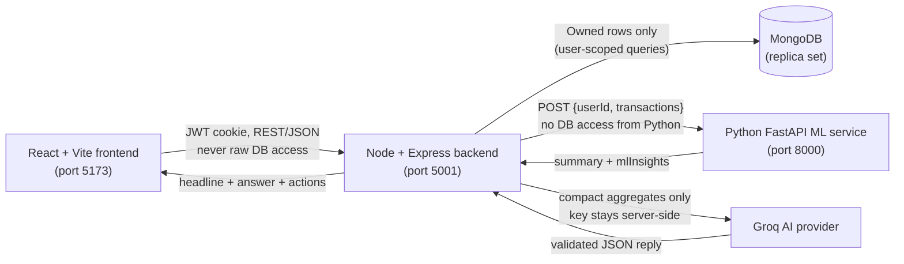

# Hishab — AI Financial Coach for Everyday Money Decisions

Hishab turns raw transaction history into clear spending insight, 4-week cash-flow forecasts, and safe, auditable goal savings — explained in **Bangla, English, and Banglish** by a bilingual AI coach.

## Hackathon

| Item | Details |
| ---- | ------- |
| Event | Upay MFS AI Hackathon |
| Track | Track 03: Customer Innovation & Financial Independence |
| Team | AUST_Hotasha |
| Members | Arafat Akib, Ehsanur Rahman, Shahriar Hamim |

## Problem Statement

User:
Bangladesh MFS users with irregular or tight monthly cash flow.

Problem:
They often discover a cash-flow shortfall only after spending has already happened.

Consequence:
This can force delayed bills, reduced savings, or unplanned borrowing.

Measurable metric:
Percentage of completed user-months where recorded expenses exceed recorded income.

Intervention:
A multilingual Shortfall Prevention Plan based on the user's own transaction history.

Success criterion:
A lower observed cash-flow-shortfall rate after accepted plans, reported only with sufficient longitudinal evidence and never claimed as causal without a controlled study.

Operational definition (used verbatim in code, UI, reports, seed data):
Historical cash-flow shortfall month = a completed calendar month where total recorded expenses exceed total recorded income. Call this "cash-flow shortfall," not "negative wallet balance," unless a verified month-start wallet balance and full wallet ledger make actual balance reconstruction possible. A forecasted shortfall = projected four-week expenses exceed projected four-week income, or the existing cumulative predicted balance becomes negative when a reliable current wallet balance is available.

Details: `PRODUCT_OUTCOME_REPORT.md` (methodology, synthetic demo baseline, funnel, research status, limits) and `docs/JUDGE_DEMO_SCRIPT_60S.md` (60-second demo). Research package: `docs/USER_RESEARCH_PROTOCOL.md`, `docs/INTERVIEW_GUIDE_BN_EN.md`, `docs/RESEARCH_CONSENT.md`, `docs/USER_RESEARCH_RESULTS_TEMPLATE.md`. Status: user interviews pending — no qualitative claims are made yet. All demo numbers are labelled synthetic; real-user metrics stay empty/pending until consented study data exists.

## Solution Overview

Hishab takes a user's own transaction data and turns it into:

- **Shortfall Prevention Plan (core intervention)** — detects upcoming shortfall risk, explains the top driver from the user's own transactions, gives at most one concrete action, and records useful / not-useful / completed with Bangla / English / Banglish (`GET /api/shortfall/plan`, `ShortfallPlanCard` first card on Forecast + AI Assistant).
- **Shortfall progress tracking (primary outcome)** — transaction-derived baseline shortfall rate over completed months only, forecasted risk, and observational pre/post comparison (`GET /api/shortfall/outcome`, `ShortfallProgressCard`). Current partial month never counts; thin history shows "insufficient history".
- **Spending analytics (supportive)** — totals, top categories, weekly history, and dashboard views.
- **4-week forecast (supportive: risk detector)** — predicted income/expense per week with a weekly shortfall risk.
- **Unusual-expense detection (supportive)** — IsolationForest on real data, IQR rule on small data, always labelled with the method used; flags an unusual expense that may contribute to a possible shortfall.
- **Smart alerts (supportive)** — deduplicated future-shortfall and unusual-spending notifications.
- **Zakat calculation (separate utility, not part of the primary success metric)** — deterministic 2.5% math on nisab rules with labelled live-or-reference market data.
- **Savings goals (supportive: help only after immediate shortfall risk is understood)** — manual contributions plus priority-based weekly/monthly automation.
- **Bilingual AI coaching** — Bangla / English / mixed explanations grounded only in the user's own data.
- **Safe goal actions** — chat can add savings (with wallet-balance conditions) and delete goals (with explicit confirmation) through deterministic, auditable backend services. The LLM never touches money.

## Key Features

| Area | What is implemented |
| ---- | ------------------- |
| Wallet | In-app wallet with number, BDT balance, add/withdraw money |
| Transactions | Income/expense tracking across 12 categories, history and filters |
| Dashboard & Analytics | Totals, category breakdown, spending trends, monthly summaries |
| Forecasting | 4-week LinearRegression forecast (or honest historical-average fallback) with per-week shortfall risk (`low` / `medium` / `high`) |
| Unusual spending | IsolationForest flags (10+ expenses) or IQR fallback, newest-first, capped list |
| AI coach | Bangla / English / mixed replies, at most 3 actions, disclaimer on every reply, 10 questions per 10 minutes per user |
| Manual goal saving | `POST /api/goals/:id/add-savings` moves Wallet to Goal atomically with idempotency keys |
| Goal automation | Weekly/monthly cycles, fixed 5/10/15/20/25% choices, priority order (1 funded first), pause/resume, per-cycle idempotency |
| Run now (demo) | `POST /api/goals/automation/run-now` processes only the logged-in user's currently-due cycle plus releases — same safety as the scheduler |
| Target-date release | Due goals release `savedAmount` back to the wallet exactly once, with income Transaction, ledger row, and alert |
| Funded goal deletion | Deletes the goal and refunds `savedAmount` to the wallet with a `Savings` income Transaction and a `goal_cancelled_refund` ledger row; retries never refund twice |
| AI chat contribution | Commands like “Add 500 taka to my iPhone goal” execute directly; optional wallet-balance conditions (strictly greater-than) are enforced server-side |
| AI-assisted deletion | “Delete my iPhone goal” proposes; “Yes, delete iPhone goal” executes via the same refund service; ambiguous titles ask the user to choose |
| Zakat calculator | 2.5% on cash, gold, silver, business, foreign assets and optional pension; gold nisab 87.48 g, silver nisab 612.36 g; live metals/FX when configured, otherwise clearly labelled demo reference values |
| Alerts | Shortfall, anomaly, balance, spending, budget, and savings-goal alerts with `sourceKey` deduplication |
| Privacy | Profile wallet card shows the wallet number only, never the balance; Groq sees aggregates, never raw transactions or PII |
| Auth & theme | Phone + PIN register/login, HttpOnly JWT cookie, per-user rate limits, dark/light mode |

## Demo Flow for Judges

Ready-made demo accounts (dummy data for testing only — all use PIN `123456`):

| # | Phone | PIN |
| - | ----- | --- |
| 1 | 01800000000 | 123456 |
| 2 | 01600000000 | 123456 |
| 3 | 01500000000 | 123456 |
| 4 | 01700000000 | 123456 |
| 5 | 01900000000 | 123456 |
| 6 | 01400000000 | 123456 |

If any account fails to log in (e.g. fresh database), register a new account on the Register page in under a minute.

1. **Login** with one of the demo accounts above, then open the Dashboard.
2. **Add wallet money and a few transactions** (salary income plus food and transport expenses across different dates — forecasts need several weeks of history for the full ML path).
3. **View Dashboard and Analytics** for totals, categories, and trends.
4. **Open AI Assistant, generate insights, and ask a Bangla/Banglish question**, e.g. “Ei mashe amar khoroch kothay beshi?”
5. **Create a goal** (e.g. Emergency Fund) and **add savings** from the Goals page.
6. **Try a safe AI command**, e.g. “Wallet e 500 takar beshi thakle Emergency Fund goal e 500 taka add koro”. It executes only if the wallet balance is strictly above 500 BDT, the goal is active, and funds suffice — otherwise it explains why in Bangla/English and moves nothing.
7. **Press “Run now (demo)”** on the Goals page to process the currently-due automation cycle and any due releases for your account only. Repeating it never double-deducts.
8. **Check Transactions and transfer history**: every goal movement has a matching `Savings` Transaction and an immutable GoalTransfer ledger row.

Required conditions: the backend needs a MongoDB replica set for any money movement, the AI service should be running for forecasts, and Groq credentials are needed for live coach replies (otherwise a clear “not configured” message appears).

## System Architecture



The browser never talks directly to the AI provider or the ML service. All auth, ownership checks, and money movement live in the Node backend. FastAPI is stateless (Pandas + Scikit-learn, no database), and Groq receives only a compact privacy-safe summary — totals, top categories, forecast, goals, recent chat, active alerts — never raw transactions or personal data.

## Technology Stack

| Layer | Stack |
| ----- | ----- |
| Frontend | React 19, Vite, Tailwind CSS v4, shadcn UI, React Router, TanStack Query, Recharts, next-themes, Axios |
| Backend | Node.js, Express 5, Mongoose, node-cron (Asia/Dhaka), express-rate-limit, jsonwebtoken, bcryptjs, Groq SDK |
| Database | MongoDB (replica set required for multi-document transactions) |
| ML/AI | FastAPI, Pandas, Scikit-learn (LinearRegression, IsolationForest), Groq chat completions (JSON mode, temperature 0.3) |
| UI | shadcn components, Sonner toasts, light/dark theme, responsive layouts |
| Security | HttpOnly JWT cookie, per-user rate limits, server-side ownership filters, strict input validation |
| Testing | `node --test` (backend + frontend), plain-Python ML checks, `mongodb-memory-server` replica set for transaction tests |

## Safe Money Movement and Responsible AI

This is the core promise to users and judges: **the LLM never moves money.**

- **Deterministic money services only.** Every transfer runs in `goalAutomationService.js` (`executeManualContribution`, `executeGoalDeletion`, scheduled contributions, releases). Chat and coach code can only request these services — they cannot deduct, credit, or invent amounts.
- **JWT user scoping.** All routes sit behind `authMiddleware`; every query filters by the JWT user (`{ _id, user }`). One user can never read or modify another user's wallet or goals.
- **Goal ownership and status checks.** Contributions accept active goals only; released, cancelled, paused, or completed goals cannot receive money. Clients can never set `savedAmount` directly, and `released` is system-only.
- **Atomic sessions.** Wallet, Goal, GoalTransfer, and Transaction writes happen inside one MongoDB transaction/session — any failure aborts everything, so balances and history can never disagree.
- **Idempotency.** Manual transfers carry client idempotency keys (sparse unique index); automation uses unique `(user, goal, type, cycleKey)` ledger keys plus per-cycle markers. Retries, double-clicks, scheduler restarts, and concurrent requests collapse to one transfer.
- **Deletion requires confirmation.** Chat proposes first (“Yes, delete …” executes); ambiguous titles show matching goals and move nothing until the user chooses.
- **Honest AI boundaries.** The coach answers from supplied aggregates only, caps replies (3 actions max), and always disclaims estimates. It gives no investment, credit, lending, tax, legal, or religious rulings — Zakat help is general-concept only plus the deterministic calculator.
- **Privacy-safe provider context.** Groq receives aggregates (totals, categories, forecast, goals, recent messages, active alerts). Raw transactions, emails, phones, passwords, and secrets never cross the provider boundary, and chat history stores message texts only.

## Privacy & Data Governance

Stored: transaction records, wallet/goal records, forecast snapshots, alerts, chat messages, goal-transfer audit records (`backend/src/models/`).

Sent to the external LLM: aggregated and minimised financial context only — totals, top categories, forecast weeks, goals, wallet balance, recent chat texts, active alerts (`buildCoachContext` in `backend/src/controllers/aiControllers.js`).

Never leaves the backend: raw transactions, phone numbers, passwords/PINs, JWTs, wallet numbers, API keys and secrets. The provider key stays server-side; chat history stores message texts only. Asserted by `backend/tests/privacyBoundaries.test.js`.

Retention (configurable via `CHAT_RETENTION_DAYS` / `FORECAST_RETENTION_DAYS` / `ALERT_RETENTION_DAYS`, defaults 90/180/90): chat messages expire after ~90 days; forecast snapshots after ~180 days (each user's latest snapshot is always kept); read+resolved alerts after ~90 days (unread/actionable alerts survive). Goal-transfer audit rows and transactions are immutable and are never deleted by cleanup — money-movement integrity depends on them (`retentionService.js`, `retention.test.js`).

Deletion/export limitations: no self-serve export API exists. Clear-chat deletes messages; PIN-confirmed Delete-account removes profile rows (goal-transfer orphans remain as audit evidence). No encryption-at-rest, anonymisation pipeline, deletion-rights workflow, compliance certification, or legal-compliance claim is made — none is implemented.

Synthetic-data statement: all demo accounts, screenshots, seed data, fixtures, and evaluation numbers in this repo are synthetic. They do not represent real customers or real financial behavior.

In-app notice: the AI Assistant shows a concise Trust & Safety section with the same boundaries.

## Threat Model and Security Controls

Attacker: any authenticated user typing into chat (untrusted data). Goals: override system rules (“ignore previous rules”), reveal hidden prompt/API keys/private context/another user's data, fabricate balances/transactions/forecasts/goals, smuggle instructions inside benign text.

Controls: strict system instruction ordering the model to ignore embedded instructions; user message labelled “untrusted text” and answered only from the trusted summary (`buildCoachPrompt`); JSON-schema validation; numerical-grounding replacement guard; JWT user scoping on every query; deterministic money services only — the LLM can never invoke a transfer (chat proposes a read-only token; only explicit confirm-token moves money). Tested by `coachPromptInjection.test.js` (BN/EN/Banglish), `coachNumberGuardHardening.test.js`, `goalActionAuth.test.js`. Full model in `backend/src/services/promptInjectionGuard.js`.

CSRF design: HMAC-signed double-submit tokens (`exp.rand.sig`). `GET /api/auth/csrf-token` mints the token as an `XSRF-TOKEN` cookie + JSON; mutating cookie-authenticated routes require an identical `x-csrf-token` header with valid signature and unexpired timestamp. Rejects missing/invalid/cross-user/expired with 403. Exempt only: safe methods and session-establishing auth endpoints (login/register/token-mint). SameSite (lax dev / none+secure prod) is defence-in-depth only; CORS uses an explicit allowlist with no wildcard credentials (`backend/src/middleware/csrf.js`, `server.js`, `csrf.test.js`).

Retention policy: see Privacy section above. Cleanup (`cleanupRetention`) deletes only expired non-financial copies, keeps each user's latest forecast, and never touches `GoalTransfer`/`Transaction`.

## Segment, Fairness, Confidence, Calibration, Human Review

Segments (non-sensitive usage patterns only): history length (4–7 / 8–15 / 16+ weeks), income regularity (recurring salary-like vs irregular), spending pattern (stable vs volatile), transaction density (low/medium/high). Protected attributes are forbidden keys and never inferred; reports carry segment labels + numbers + sample counts only, with null / “not enough evidence” below 4 samples (`ai-service/segments.py`, `tests/test_segments.py`). These checks measure performance consistency across usage patterns, not demographic fairness.

Forecast: MAE/RMSE by segment for income and expense. Anomalies: precision/recall/F1/false-positive rate by segment. See `EVALUATION_REPORT.md` §§10–12 and `RESPONSIBLE_AI_AND_SECURITY_REPORT.md` §§2–4 for computed values.

Confidence (observable evidence only — history weeks, holdout error, stability, salary/festival evidence): `high | medium | low` plus reasons (`ai-service/confidence.py`). Tolerance band = max(BDT 500, 20% of mean weekly expense); calibration reports per-bucket coverage and claims “calibrated” only when high > medium > low strictly — otherwise it states not calibrated.

Human-review and fallback: low confidence/insufficient data → labelled historical-average fallback + “Review manually”, no recommendation; uncertain anomalies → “review this expense” (never fraud); shortfall/repeated false positives → review action, never auto-transfer; provider/model failure → fallback or unavailable state. No model output can transfer, modify a goal, or make irreversible financial decisions. UI shows confidence, data quality, fallback reason, segment, and Confirm/Cancel on every proposal.

## Folder Structure

```text
Hishab/
├── frontend/                 # React 19 + Vite + Tailwind app (port 5173)
│   ├── src/pages/            # Dashboard, Transactions, Analytics, Goals,
│   │                         # AiAssistant, Forecast, Zakat, Profile, ...
│   ├── src/components/       # AppLayout, dashboard widgets, ai/, ui/ (shadcn)
│   ├── src/api/              # Axios client + per-domain endpoints
│   ├── src/hooks/            # React Query hooks (wallet, goals, chat, AI, ...)
│   ├── src/lib/              # format, dashboard helpers, auth validation
│   └── tests/                # node:test UI invariant tests
├── backend/                  # Node + Express API (port 5001)
│   ├── src/models/           # User, Wallet, Transaction, Goal, GoalTransfer,
│   │                         # Alert, Summary, ForecastSnapshot, ChatMessage
│   ├── src/routes/           # auth, wallet, transactions, goals, ai, chat,
│   │                         # alerts, summaries, forecasts, zakat
│   ├── src/controllers/      # request handling incl. aiControllers,
│   │                         # aiGoalControllers (chat goal actions)
│   ├── src/services/         # goalAutomationService, aiGoalActionService,
│   │                         # groqCoachService, zakatService,
│   │                         # marketDataService, mlAlertService
│   ├── src/jobs/             # node-cron goal automation schedules
│   ├── src/middleware/       # JWT auth, rate limits, ObjectId validation
│   ├── tests/                # node:test suites (replica-set backed)
│   ├── AI_INTEGRATION.md     # backend ↔ FastAPI contract and coach details
│   └── GOAL_AUTOMATION.md    # automation rules, API, and test scenarios
├── ai-service/               # FastAPI ML microservice (port 8000)
│   ├── main.py               # GET /health, POST /analyze-transactions (+ optional festivalDates)
│   ├── ml_service.py         # forecast, contextual anomalies, risk, evaluation + signals
│   ├── evaluation.py         # leakage-safe expanding-window temporal evaluation (MAE/RMSE/sMAPE)
│   ├── patterns.py           # salary-cycle + Bangladesh festival signals (Asia/Dhaka)
│   ├── requirements.txt      # Python dependencies
│   └── tests/                # fixtures + test_ml_service.py (no pytest needed)
│       ├── test_evaluation.py, test_patterns.py, test_anomalies_context.py
│       └── generate_eval_report.py  # regenerates EVALUATION_REPORT.md
├── EVALUATION_REPORT.md      # computed fixture metrics, date ranges, limits (no invented claims)
└── README.md                 # this file
```

## Local Setup

Open three PowerShell windows. All commands run from the project root `D:\Projects\Hishab`.

**1. Backend (port 5001)**

```powershell
cd D:\Projects\Hishab\backend
npm install
Copy-Item .env.example .env
# Edit .env and fill in your own values (never commit them)
npm run dev
```

**2. AI service (port 8000)**

```powershell
cd D:\Projects\Hishab\ai-service
python -m venv .venv
.\.venv\Scripts\Activate.ps1
pip install -r requirements.txt
Copy-Item .env.example .env
uvicorn main:app --reload --host 127.0.0.1 --port 8000
```

If virtual-environment activation is blocked, run once and retry:

```powershell
Set-ExecutionPolicy -Scope CurrentUser -ExecutionPolicy RemoteSigned
```

**3. Frontend (port 5173)**

```powershell
cd D:\Projects\Hishab\frontend
npm install
npm run dev
# open http://localhost:5173
```

| Service | Default port | Health / entry point |
| ------- | ------------ | -------------------- |
| Frontend | 5173 | `http://localhost:5173` |
| Backend | 5001 | `GET http://localhost:5001/` → `Server working` |
| AI service | 8000 | `GET http://127.0.0.1:8000/docs` (Swagger) |

The backend needs a MongoDB replica set (Atlas or local `mongod --replSet`) because money movement uses multi-document transactions. A standalone server refuses transfers with a clear 503 message.

## Environment Variables

Only names from the shipped `.env.example` files are listed. Copy each example to `.env` and fill in your own values.

**Backend (`backend/.env.example`)**

| Variable | Purpose |
| -------- | ------- |
| `NODE_ENV` | Runtime mode (`development`) |
| `PORT` | Backend port (default `5001`) |
| `CLIENT_URL` | Allowed frontend origin(s) for CORS |
| `JWT_SECRET` | Signs the HttpOnly auth cookie |
| `DB_URL` | MongoDB connection string (must be a replica set) |
| `AI_SERVICE_URL` | FastAPI base URL (defaults to `http://127.0.0.1:8000`) |
| `GROQ_API_KEY` | Groq key; coach replies 503 without it |
| `GROQ_MODEL` | Groq model id (example default `openai/gpt-oss-20b`) |
| `METALS_API_BASE_URL` | Optional live metals provider for Zakat |
| `METALS_API_KEY` | Key sent as `x-api-key` to the metals provider |
| `FX_API_BASE_URL` | Frankfurter-compatible FX provider for Zakat |
| `FX_FALLBACK_API_BASE_URL` | Optional second FX provider before reference values |
| `FX_FALLBACK_API_KEY` | Key sent as `apikey` to the fallback FX provider |
| `GOAL_AUTOMATION_DISABLED` | Set to `1` to disable the cron scheduler |
| `CHAT_RETENTION_DAYS` | Chat-message retention days for cleanup (default `90`) |
| `FORECAST_RETENTION_DAYS` | Forecast-snapshot retention days; latest per user always kept (default `180`) |
| `ALERT_RETENTION_DAYS` | Read+resolved alert retention days (default `90`) |

**AI service (`ai-service/.env.example`)**

| Variable | Purpose |
| -------- | ------- |
| `HOST` | FastAPI bind host |
| `PORT` | FastAPI bind port (`8000`) |
| `CORS_ORIGINS` | Comma-separated origins allowed to call the service |

**Frontend (`frontend/.env.example`)**

| Variable | Purpose |
| -------- | ------- |
| `VITE_API_URL` | Backend base URL (default `http://localhost:5001`) |

## Testing

| Suite | Command (from the service folder) | Coverage |
| ----- | --------------------------------- | -------- |
| Backend | `npm test` (`node --test tests/*.test.js`) | Goal deletion refund (zero-balance, funded, retry/concurrency, release-vs-delete race, cross-user block); AI add-money confirm-first (propose never moves money, token confirm moves once, ambiguous/condition/inactive/cross-user/idempotent paths); AI action parsing; coach numerical grounding (22 BN/EN/Banglish cases + scorer unit checks); number-guard replacement hardening (9 attacks + 3 grounded); prompt-injection suite (BN/EN/Banglish override, reveal, fabricate, embedded); CSRF double-submit (valid/missing/invalid/cross-user/expired/exempt/flags); retention cleanup + immutable-ledger protection; privacy boundaries; snapshot metadata schema |
| AI service | `python tests/test_ml_service.py` | 23 checks: regression vs fallback selection, forecast weeks, non-negative clipping, risk rules, outlier flagging, income-only and identical-amount edges |
| AI service eval | `python tests/test_evaluation.py` | 28 checks: expanding-window temporal split, LR-wins vs baseline-wins fixtures, ineligible-data honesty, finite/reproducible/hand-checked MAE-RMSE-sMAPE |
| Forecast validation | `python tests/test_forecast_validation.py` | 45 checks: transaction-level chronological split, independent OLS/mean recomputation, per-series winners, spy proofs of no holdout leakage, rolling-origin cutoffs |
| Anomaly validation | `python tests/test_anomaly_validation.py` | 25 checks: independently labelled 38-case fixture, TP/FP/FN + precision/recall/F1, rent-not-flagged, label non-exposure |
| AI service patterns | `python tests/test_patterns.py` | 18 checks: payday detection, thin/unstable-history fallback, learned festival uplift, no-adjustment reasons, no-leakage, no invented bonus |
| AI service anomalies | `python tests/test_anomalies_context.py` | 16 checks: recurring rent spared, Food outlier flagged, novel merchant flagged, sparse fallback, income-only no-crash, determinism |
| AI segments/confidence | `python tests/test_segments.py` | 24 checks: non-sensitive segment classifiers, genuine 12-user segmentEvaluation (fallback rate, FPR, insufficient-evidence nulls, no-PII report), confidence levels, honest calibration buckets, human-review defaults |
| Eval report | `python tests/generate_eval_report.py` | Regenerates `EVALUATION_REPORT.md` from deterministic fixtures (numbers are computed, never typed) |
| Responsible-AI report | `python tests/generate_responsible_report.py` | Regenerates `RESPONSIBLE_AI_AND_SECURITY_REPORT.md` (segment metrics, FPR, calibration buckets, controls, limits) |
| Coach probe (opt-in) | `node scripts/eval-coach-grounding.mjs --live` (backend, needs `GROQ_API_KEY` + `GROQ_MODEL`) | Live Groq numerical-grounding probe on synthetic aggregates; never runs in CI |
| Frontend | `npm test` (`node --test tests/*.test.js`) | Profile wallet-card privacy (no balance rendered, wallet number kept, other balance UI intact) |
| Lint / build | `npm run lint`, `npm run build` | ESLint and production Vite build |

Backend tests spin up an in-memory MongoDB replica set via `mongodb-memory-server` (first run downloads a binary), so no local database is needed for tests.

## Model Evaluation & Reliability (judge-ready)

- **Chronological train/test methodology.** No random splitting, ever. Transactions are aggregated into Monday-start weekly buckets exactly as production does (`build_weekly_history`). Training data = earlier weeks only; test data = the later unseen consecutive weeks, with the latest 4 weeks kept as the final untouched holdout forecasting horizon. With enough history, expanding-window rolling-origin evaluation scores every eligible cutoff (train grows week by week); earlier cutoffs are validation folds, the last cutoff is the holdout, and nothing performs model selection or feature tuning on it.
- **No future transactions enter training.** Raw transactions are sliced at the first holdout Monday: every trend fit, historical-average baseline, salary-pattern search, and festival-uplift estimate receives only transactions dated strictly before the cutoff. Holdout transactions supply scoring targets and nothing else. Spy tests (`test_forecast_validation.py`) record every fitting/feature input and assert the boundary `train max < cutoff <= test min`.
- **LinearRegression vs historical-average baseline.** The baseline predicts each future week with the mean weekly income/expense computed from training weeks only. Both models are scored per series: income MAE, income RMSE, expense MAE, expense RMSE. MAE = mean |forecast − actual| in BDT (robust average miss); RMSE = √(mean squared miss) in BDT (punishes big misses). Winners are chosen per series (`linear_regression` / `historical_average_baseline` / `tie`); exact ties resolve to `tie`. Returned as the machine-readable `forecastEvaluation` object (`splitStrategy: expanding_window_temporal_holdout`, train/test dates, per-model MAE/RMSE, per-series winners), persisted on `ForecastSnapshot` alongside the legacy `evaluation` block.
- **Insufficient-data behavior.** Under 8 weekly buckets (4 train + 4 test) the object returns `eligible: false`, an honest reason, and null metrics/winner — accuracy values are never invented.
- **Anomaly precision/recall on independent labels.** `ai-service/tests/labelled_anomalies_v1.json` (38 cases, 4 known anomalies: large Food spend, rare high-value Shopping, 2-day velocity burst, novel merchant) was labelled by construction rules before any detector ran. The production detector runs on label-stripped transactions; detections are matched to stable `caseId`s. Precision = correct flags / all flags; recall = correct flags / all known anomalies; F1 = their harmonic mean. Measured: TP=4, FP=0, FN=0 → precision/recall/F1 = 1.0. Labels never reach production responses or Groq (asserted by test).
- **Salary/festival handling.** Payday detection needs ≥3 similar income receipts (within 25% of median) across ≥2 calendar months (Asia/Dhaka dates); otherwise `salaryPatternDetected: false`. Festival uplift uses a maintained Bangladesh calendar (Eid-ul-Fitr, Eid-ul-Adha, Pohela Boishakh, Ramadan/Eid shopping windows, Durga Puja; configurable `festivalDates` override) and learns per-user income/expense multipliers from ≥2 prior festival weeks; otherwise `festivalAdjustmentApplied: false` with a reason. No hard-coded bonus is ever assumed.
- **Contextual anomaly logic.** Per expense: log amount, amount ÷ user's own category median (≥2× = abnormal), merchant-description novelty, Asia/Dhaka weekday, and 7-day spend velocity vs prior 28-day baseline. 10+ expenses: `IsolationForest(random_state=42)` on these features, keeping only above-median + category-abnormal flags (`contextual_isolation_forest`); fewer: explainable rule fallback (`robust_contextual_fallback`). Every flag keeps the legacy `reason` plus `reasons[]`, `anomalyScore`, `severity`, `detectionMethod`. Routine rent/bills at their own norm are never flagged for amount alone.
- **Bangla/Banglish numerical grounding.** `backend/tests/coachNumericalGrounding.test.js` (22 cases: totals, net, percentages, categories, forecast + risk, goal progress/remaining, BDT/৳/comma formats, rounding edges, Bengali digits like ১২৫০, Banglish like “amar food e koto khoroch hoise?”, refusal-to-invent) scores fixture replies with `coachNumericalScorer.js` (Bengali-digit normalisation, BDT 1.0 absolute / 0.5% relative tolerance, language routing, hallucination rate). JSON validity is never treated as correctness. Live replies pass `applyNumericGroundingGuard`, which appends an explicit caution when figures are not derivable from context. Live Groq probing is opt-in (`--live`, env-gated); CI is fully offline.
- **Where to look.** Forecast page and AI Assistant show an “Evaluation & reliability” card (train/test dates, trend-vs-average table, not-enough-data state, salary/festival state, expandable “How this was checked”). Full computed numbers: `EVALUATION_REPORT.md` (regenerate with `ai-service/tests/generate_eval_report.py`).
- **Privacy & safety.** Groq receives aggregates only — never raw transactions, labels, or PII. Money movement is unchanged (deterministic backend services; the LLM never moves money).
- **Fixture ≠ production accuracy.** All reported numbers come from small, clean synthetic fixtures. They validate methodology and guard regressions; they do not prove real-world accuracy. Real-world validation needs labelled user data collected over time. `EVALUATION_REPORT.md` states this explicitly alongside the measured values.

## Differentiation & Impact Validation (judge-ready)

**Primary hypothesis:** Compared with a standard transaction dashboard or rule-based savings planner, Hishab's combined workflow (forecast → personalized Bangla/Banglish coaching → one shortfall-prevention action → explicit goal contribution confirmation) improves savings adherence, reduces cash-flow shortfall events, or improves goal completion.

- **Comparison arms** (`GET /api/experiments/arms`, `ARMS` in `backend/src/services/experimentService.js`): **Control** (transaction list + totals + category chart; no forecast, coach, alert, or recommendation) vs **Rule-Based planner** (dashboard + fixed “save 10%” rule + manual contributions; no forecast prioritization, coaching, or shortfall prevention) vs **Hishab Combined Workflow** (4-week forecast + shortfall/surplus detection + Bangla/English/Banglish explanation + one prioritized action + forecast-gated goal suggestion + explicit confirmation + feedback capture). No real commercial competitor is named or measured — only generic categories.
- **Metrics** (denominator-explicit envelopes: numerator, denominator, sample count, date range, eligibility, limitation): `savingsAdherenceRate = actualSavingsBDT / plannedSavingsBDT` (no-plan → null, never 100%); `shortfallEventRate = shortfallMonths / completedObservedMonths` (observed vs forecasted kept separate); `goalCompletionRate = completedGoals / eligibleGoals` (on-time tracked separately; new goals excluded). Workflow funnel: `forecast_viewed → shortfall_plan_shown → coach_language_used → coach_action_accepted/dismissed → goal_suggestion_shown → goal_contribution_proposed → goal_contribution_confirmed → goal_contribution_completed → feedback_useful/not_useful` (`POST /api/experiments/events`, allowlist-sanitized metadata only).
- **Synthetic-data boundary:** deterministic simulation over 9 version-controlled scripted fixtures (`synthetic_demo_only`) validates workflow logic only — safety gate (shortfall → defer, surplus → capped suggestion), confirmation-before-completion, metric math. Results: adherence null / 0.333 / 1.0; shortfall 0.5 all arms (identical by construction); goal completion 0.333 all arms; unsafe suggestions rule-based 0.333 vs Hishab 0; overall status `insufficient_evidence`, no winner. Reproduce: `node scripts/run-synthetic-experiment.mjs` (from `backend/`). Full numbers + pilot protocol: `DIFFERENTIATION_AND_IMPACT_REPORT.md`.
- **Real-user pilot plan:** balanced assignment to the three arms, explicit consent, 2–3 monthly cycles, predefined primary metric (adherence or shortfall-event rate), ≥10 users per arm with ≥2 completed months each, attrition tracking, no causal claim until thresholds are met (`GET /api/experiments/outcomes` returns `insufficient_evidence` below them).
- **UI:** “Why Hishab?” comparison + workflow visual + “Synthetic workflow validation” results card on the landing page.

## Limitations and Roadmap

Implemented and honest about its limits:

- Forecasts are rough statistical estimates from past transactions, not guarantees; thin history triggers a labelled average fallback.
- Live coach replies require Groq credentials; without them the API returns a clear 503 and the UI shows a friendly message.
- Money movement requires a MongoDB replica set; standalone servers get a 503 with no partial writes (by design, no non-atomic fallback).
- The scheduler runs in-process: a restart exactly at tick time delays that cycle until the next tick or a manual “Run now”.
- No catch-up for cycles older than the immediately previous one; rounding is to 2 decimals.

Future roadmap (not yet built): real MFS/bank integrations, push notifications, recurring budgets, multi-wallet support, on-device Bangla voice input, and deeper scheduled-insight personalization.

## Why This Matters for Upay

- **Financial confidence.** Users see where money goes, what next month may look like, and whether a goal is on track — in their own language.
- **Engagement beyond payments.** Forecasts, alerts, goals, and coaching give users reasons to return daily, not just to transact.
- **Bangla-first inclusion.** Bangla, English, and Banglish support brings understandable finance to users poorly served by English-only tools.
- **Safe and auditable savings.** Every taka moved into or out of a goal is atomic, idempotent, and traceable in an immutable ledger — the kind of transparency a financial brand can stand behind.

## Judge Demo Script (3 minutes)

1. **Forecast page → “Evaluation & reliability”.** “We never shuffle weeks. The model trains only on weeks before the test window and is scored on the untouched last 4 weeks — train dates and test dates are shown here.”
2. **Point at the trend-vs-average table.** “Same test weeks for both. Lower miss wins; ties go to the simple average. On trending data the trend wins; on flat data the average wins — both fixtures are in the report with real numbers.”
3. **Thin-data honesty.** “With under 8 weeks there is no split and no metrics — the card says why instead of inventing accuracy.”
4. **Salary/festival signals.** “Payday is learned from your own repeated receipts, or reported absent. Festival uplift learns from your own past festival weeks, or stays off with a reason — we never assume an Eid bonus.”
5. **AI Assistant → unusual expenses + Bangla question.** “Flags explain themselves (category multiple, new merchant, pace). Ask in Banglish, e.g. ‘amar food e koto khoroch hoise?’ — every figure is checked against your data, and unverifiable numbers get an explicit caution, not silent trust.”

## Contribution and License

There is currently no `CONTRIBUTING` guide or `LICENSE` file in the repository, so the code is shared for hackathon evaluation with all rights reserved by Team AUST_Hotasha. For questions about reuse or licensing, contact the team.
